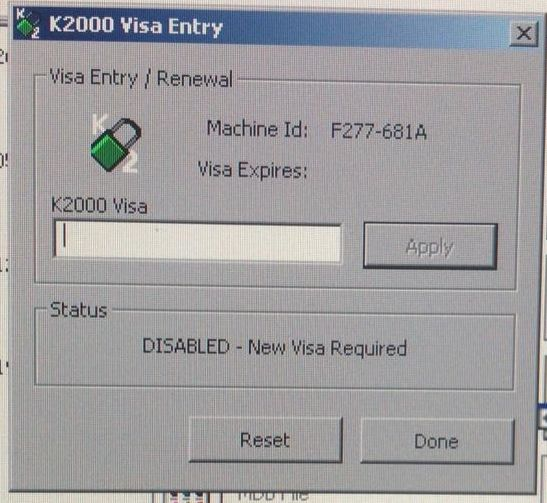

# 2000 Visa Entry Code Generator

This application generates service access codes for Philips CT medical devices using the reverse-engineered algorithm from the 2000 Visa Entry application. [Live Demo](https://codes.robertolechowski.com/)



## Run

### Access [Live Demo](https://codes.robertolechowski.com/) 

### Run in docker
```bash
cd docker
./buiild_publish.sh
docker run --rm k2000_visa_generator
```

### Run in docker composer
```bash
docker compose up
```

## Technologies
- Python
- Flask

## Todo:
 - Add other CT devices
 - Display version in web interface
